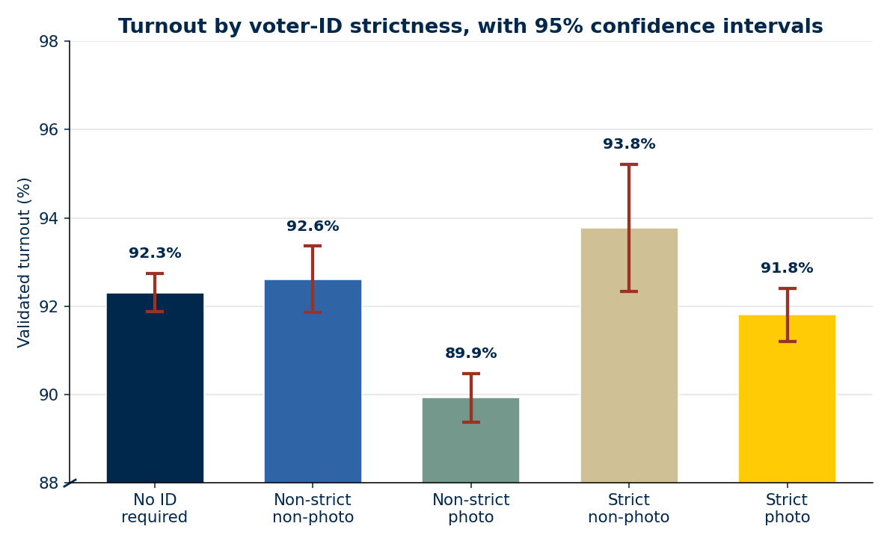
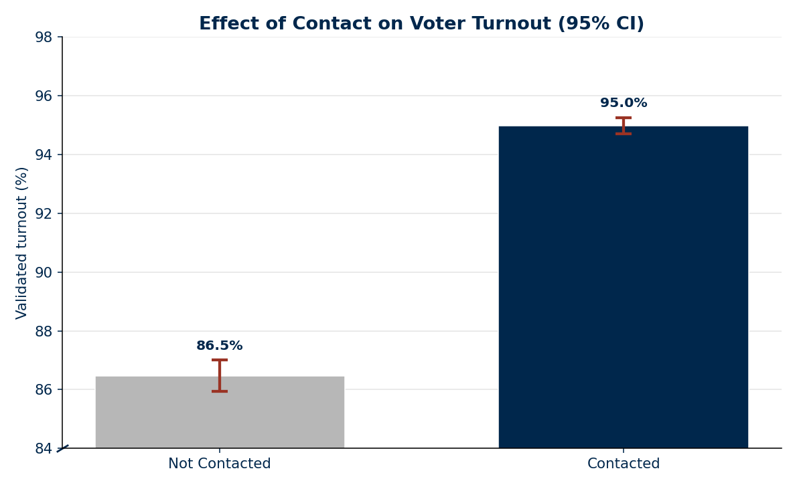
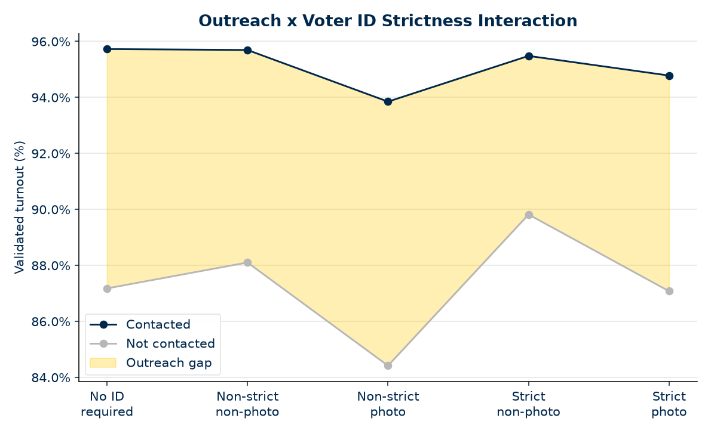
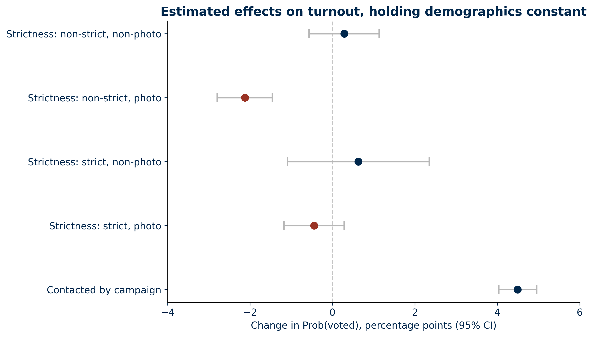

# Voter Turnout Analysis

Voter Turnout Analysis is a University of Michigan MADS (Spring/Summer 2026) project that studies how voter outreach and state voter ID laws relate to validated 2024 turnout in the Cooperative Election Study (CES).

---

## Motivation

In the 2024 U.S. presidential election, 65.3% of voting-age citizens voted, 154 million people. Public understanding of voting is often shaped by headlines and anecdote rather than evidence.

This project analyzes a central question: how do voter outreach and state voter ID law strictness affect turnout in a high-salience election, findings that can help civic organizations and campaigns identify what actually moves participation.

## Methodology

We combined the 2024 Cooperative Election Study (CES) with the NCSL's voter ID strictness classification, then fit a logistic regression to predict turnout.

- **Data**: CES 2024, around 60,000 respondents
- **Voter ID strictness**: 5 categories from NCSL, merged onto CES via state
- **Data cleaning**: We derived validated turnout and predictors from the CES data using documented column mappings, dropped respondents without a voting record (leaving 39,800 rows), and merged in NCSL voter ID strictness by state FIPS code.
- **Outcome**: Validated turnout, not self-report
- **Model**: Binary logistic regression
- **Key treatments**: Voter ID strictness, 4 outreach channels (in-person, phone, email/text, mail), and their interactions
- **Controls**: Age, race, gender, education

## Exploratory Data Analysis (EDA)





**Turnout by Campaign Contact**: 95.0% among contacted respondents vs. 86.5% not contacted, an 8.5-point raw gap.



**Outreach Gap by Strictness**: Gap present in every category, but varies rather than staying constant.

## Evaluation

### Hypothesis

- **Voter ID Laws (H1)**: Stricter laws -> lower odds of voting
- **Outreach (H2)**: Experiencing outreach -> higher odds of voting
- **Outreach x Voter ID Laws (H3)**: Outreach's effect on turnout differs by ID law strictness, likely stronger in stricter states.

### Average Marginal Effects (AME)



- AME is computed by averaging each person's predicted change in voting probability when a treatment is switched on vs off, holding demographics constant.
- **Contact**: +4.5 pts (95% CI: 4.0-5.0), strongest effect overall.
- **Non-strict**, photo ID: -2.1 pts (95% CI: -2.9-1.5), the only significant ID-strictness effect.

After controlling for demographics, voter ID strictness largely ceases to predict turnout, suggesting the raw pattern reflected population composition rather than the law itself.

### Interpretation of Results

- Outreach: +4.5 point increase in voting probability, robust and significant, supporting H2.
- Email/text and mail show the strongest individual effects; phone calls show a smaller significant effect; in-person contact alone is not significant, a surprising result worth further study
- Voter ID laws: Only non-strict, photo ID shows a significant effect; the other three categories (including both "strict" classifications) are not distinguishable from chance
- H1 (voter ID) is only partially supported: the effect holds for one category, not consistently across strictness levels
- Interaction: No significant outreach × strictness effects; outreach's benefit appears consistent regardless of ID law strictness
- Outreach, especially email/text and mail, is a more consistent predictor of turnout than voter ID strictness in this election

### Limitations

- Validated turnout was 91.6% vs. the Census's 65.3%, since CES respondents self-select into the survey.
- Neither outreach nor voter ID law is randomly assigned, so results are associations, not causation

### Ethical Concerns

- Avoided reporting on subgroups small enough to identify individuals
- Framed findings around expanding participation, not enabling targeting or suppression
- Treat ID laws' disproportionate impact on voters of color as structural, not a group trait

### Future Directions

- Multi-year data for a difference-in-differences design
- Per-channel outreach effects, not just an aggregated "contacted" effect
- Add campaign spending and policy-attitude controls
- Test whether patterns hold in lower-salience elections

**Statement of work**: This project builds on Sahana Sundar's original SIADS 688 analysis plan. Andy (lead developer), Melody (lead visualizer), and Sahana (project manager) all contributed to scope, coding, and writing, with mentorship from Laura Stagnaro.

---

## Install and run

Requires **Python 3.13+**. Run from the directory where you want data stored:

```bash
python -m venv .venv
source .venv/bin/activate   # Windows: .\.venv\Scripts\Activate.ps1
pip install git+https://github.com/atunison3/capstone.git
unhash capstone  # If you've already install it before
capstone
```

What `capstone` does:

1. Guides you through obtaining CES data (manual download from Harvard Dataverse).
2. Downloads Census FIPS state codes and NCSL voter ID classifications into **`./.data/`** (current working directory).
3. Cleans and merges the datasets using settings from `capstone/config.py`.
4. Fits a logistic regression of validated turnout and prints coefficient results with an **Expit** column via `calculate_probabilities`.

Configuration ships inside the package (`capstone.config`). Relative `.data` is resolved at runtime so installers and loaders share one path — data is **not** written under `site-packages`. See [Configuration](docs/documentation/configuration.md).

CES data cannot be fully automated (Harvard Dataverse WAF). When prompted, download the CES CSV into your user `Downloads` folder; the tool moves it into the resolved data directory as `ces_data.csv`.

---

## What this project does

| Area | Role |
| --- | --- |
| Data setup | Obtain CES, FIPS, and NCSL inputs |
| Cleaning | Rename, map, and merge survey + state policy data |
| Modeling | Logistic regression of validated turnout |
| Visualization | Report figures for outreach and voter ID effects |

## License

This project is licensed under the **MIT License**. See [License](docs/about/license.md) file.

Third-party datasets used by the analysis keep their own terms and are not re-licensed as MIT by this project.

## Team

Built by Sahana Sundar, Melody Ren, and Andy Tunison, with mentorship from Laura Stagnaro and support from the UMich MADS teaching staff.

- [Meet the team](docs/about/meet-the-team.md)
- [Acknowledgements](docs/about/acknowledgements.md)

## Next steps

- [Installation](docs/getting-started/installation.md) — prerequisites and install options
- [Usage](docs/getting-started/usage.md) — CLI and Python API examples
- [Full documentation](docs/documentation/README.md) — package and module reference
- [Contributing](docs/contributing/README.md) — developer setup
- [Meet the team](docs/about/meet-the-team.md) — contributors
- [Acknowledgements](docs/about/acknowledgements.md) — mentors and program
- [AI statement](docs/about/ai-statement.md) — how AI was used on this project
- [License (MIT)](docs/about/license.md) — terms of use
