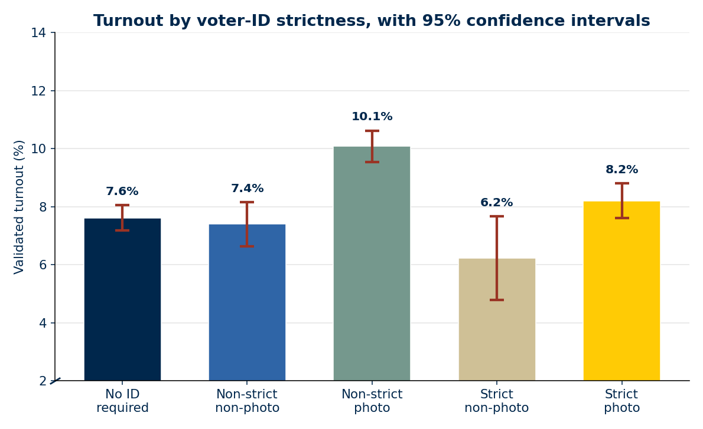
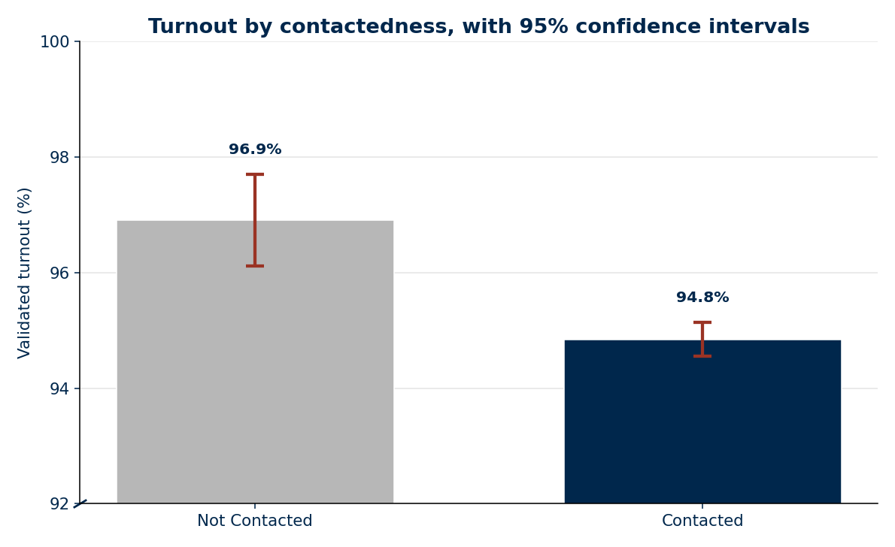
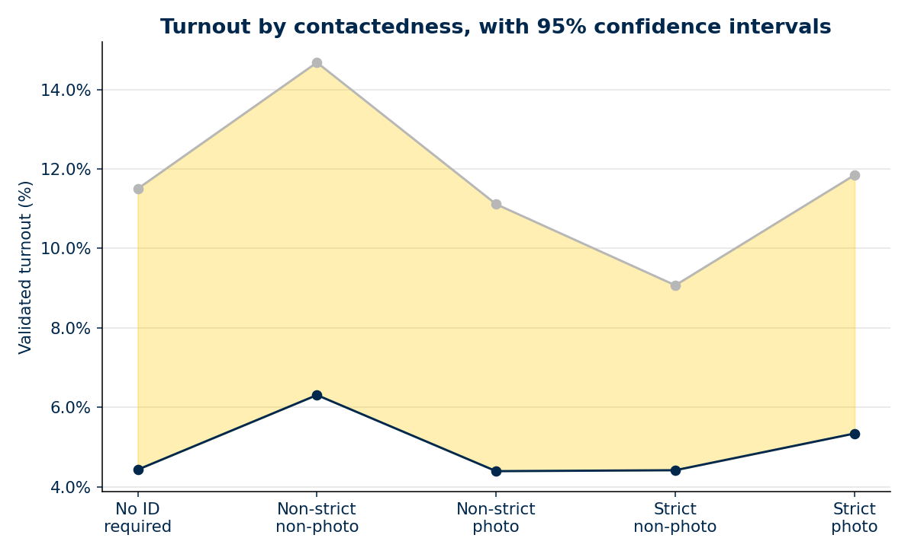

# Capstone

- [ ] TODO: Verify the NCSL data
- [ ] Add figure 4
- [ ] Verify code on figure 4
- [ ] Add figure 5
- [ ] Add legend to figure 3






## Installing Repository

Verify python version is 3.13. I am using 3.13.2 [Python](https://www.python.org/downloads/release/python-3132/).

```terminal
python --version
python3.13 --version
```

For Windows:

```terminal
python --version
py -3.13 --version
```

Clone the [capstone repository](https://github.com/atunison3/capstone). You'll be able to clone it but you'll need permission to push changes.

```terminal
git clone https://github.com/atunison3/capstone.git
```

Install requirements.

```terminal
python -m pip install --upgrade pip
python -m venv .venv
source .venv/bin/activate
pip install -r requirements.txt
python -m build
```

Windows:

```terminal
python -m pip install --upgrade pip
python -m venv .venv
.venv\Scripts\activate
pip install -r requirements.txt
python -m build
```

## Contributing

To contibute, you will need to work on a branch other than main. When you are finished with your changes, push them to your branch and perform a PR. Rules will be enabled such that at least one reviewer must approve changes.

```terminal
git add .  # Or specify which files to add
git commit -m "Commit Message"
git push origin <branch-name>
```

Safety and linting checks will be performed on each push. I suggest running a formatter and linter prior to committing your work.

```terminal
black . # The uncompromising code formatter.
ruff check  # An extremely fast Python linter and code formatter.
bandit . # Python source code security analyzer
mypy .  # Program that will type check your Python code.
```

### Running Projects

To run a script, simply navigate to the project directory and run `python <script_name>.py`

```terminal
python src/main.py
```

### Data

You can download the 2024 Cooperative Election Study data and code books from the [Harvard Dataverse](https://dataverse.harvard.edu/dataset.xhtml?persistentId=doi:10.7910/DVN/X11EP6).

- Download a copy of CCES24_Common_OUTPUT_vv_topost_final.csv, and upload it to the capstone/data folder before running the data_cleaning.ipynb file to clean the data.

### Configuration and data path

Project settings live in `capstone/config.py`. By default, input CSVs are read from `.data/` (`DATA_PATH`).

To use another directory, change `DATA_PATH` in `capstone/config.py` (prefer an editable install while developing):

```python
from pathlib import Path

DATA_PATH = Path("/Users/<username>/Downloads/CES Data")
```

Or run the built-in installer, which writes CES / FIPS / NCSL files under `.data/`:

```bash
capstone
```
